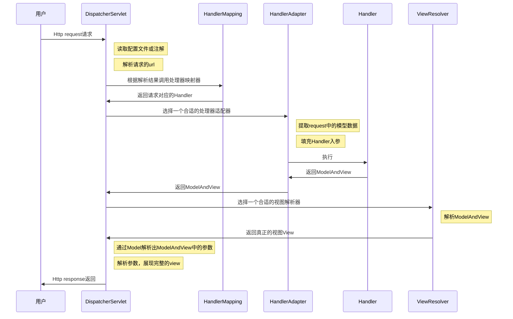

> 文章可以白嫖，公众号不能不关注，手动滑稽🤣🤣 &nbsp;
>
> 欢迎大家关注：**武哥聊编程**、**Java开发宝典**，您的支持，是我们创作的持续动力！&nbsp;&nbsp;

----

springmvc 是一个基于mvc的web框架，是 spring 框架的一个模块，所以springmvc和spring无需通过中间整合层进行整合。我们先来看下spring的一个架构模型，看springmvc在spring框架中所处的位置：

从图中可以看出，springmvc是spring的一个web框架，所以上图中描述的是spring web mvc，它和struts2的功能差不多，下面我们来深入到springmvc内部，看它的干了些啥，先看一个图：

这个图描述了springmvc的整个执行的流程，乍一看有点晕乎，待我一步步分析，最后弄个流程图出来就明白了。

结合上图，我描述一下springmvc的执行流程：
>1. 向服务器发送Http request请求，请求被**前端控制器（DispatcherServlet）**捕获。
>2. 前端控制器根据xml文件中的配置（或者注解）对请求的URL进行解析，得到请求资源标识符（URI）。然后根据该URI，调用**处理器映射器（HandlerMapping）**获得处理该请求的Handler以及Handler对应的拦截器，最后以 HandlerExecutionChain 对象的形式返回。
>3. 前端控制器根据获得的Handler，选择一个合适的**处理器适配器（HandlerAdapter）**去执行该Handler。
>4. 处理器适配器提取request中的模型数据，填充Handler入参，执行**处理器（Handler）**（也称之为Controller）.
>5. Handler(Controller)执行完成后，向处理器适配器返回一个**ModelAndView**对象，处理器适配器再向前端控制器返回该ModelAndView对象（ModelAndView只是一个逻辑视图）。
>6. 根据返回的ModelAndView，前端控制器请求一个适合的**视图解析器（ViewResolver）**（必须是已经注册到Spring容器中的ViewResolver）去进行视图解析，然后视图解析器向前端控制器返回一个真正的视图View（html或者jsp）。
>7. 前端控制器通过Model解析出ModelAndView中的参数进行解析，最终展现出完整的View并通过Http response返回给客户端。

上面描述了一下springmvc的执行流程，如果还是有点模糊的话，我用下面这个流程图来表示一下，也为了自己更好的理解整个执行流程：

经过这么一分析，现在对springmvc的执行流程有了宏观上的了解了，从上面的分析可以看出，springmvc有几个主要的组件，下面结合我们编程，来分析一下这几个组件：
>1. 前端控制器DispatcherServlet（**不需要程序员开发**）。
作用：接收请求，响应结果，相当于转发器，中央处理器。有了DispatcherServlet减少了其它组件之间的耦合度。
2. 处理器映射器HandlerMapping（**不需要程序员开发**）。
作用：根据请求的url查找Handler。
>3. 处理器适配器HandlerAdapter（**不需要程序员开发**）。
作用：按照特定规则（HandlerAdapter要求的规则）去执行Handler。
>4. 处理器Handler（**需要程序员开发**）。
注意：编写Handler时按照HandlerAdapter的要求去做，这样适配器才可以去正确执行Handler
>5. 视图解析器ViewResolver（**不需要程序员开发**）。
作用：进行视图解析，根据逻辑视图名解析成真正的视图（view）
>6. 视图View（**需要程序员开发jsp**）。
View是一个接口，实现类支持不同的View类型（jsp、thymeleaf、pdf...）
**【注】**：不需要程序员开发的，需要程序员自己做一下配置即可。

现在看来，其实真正需要程序员开发的就两大块：一个是Handler，一个是页面，这样的话，其实和struts2就差不多了，所以不要被上面那个一系列的流程给绕傻了。

整个springmvc的架构就总结到这吧，后面就要开始走进springmvc的世界了。

------

> 文章可以白嫖，公众号不能不关注，手动滑稽🤣🤣 &nbsp;
>
> 欢迎大家关注：**武哥聊编程**、**Java开发宝典**，您的支持，是我们创作的持续动力！&nbsp;&nbsp;

---

